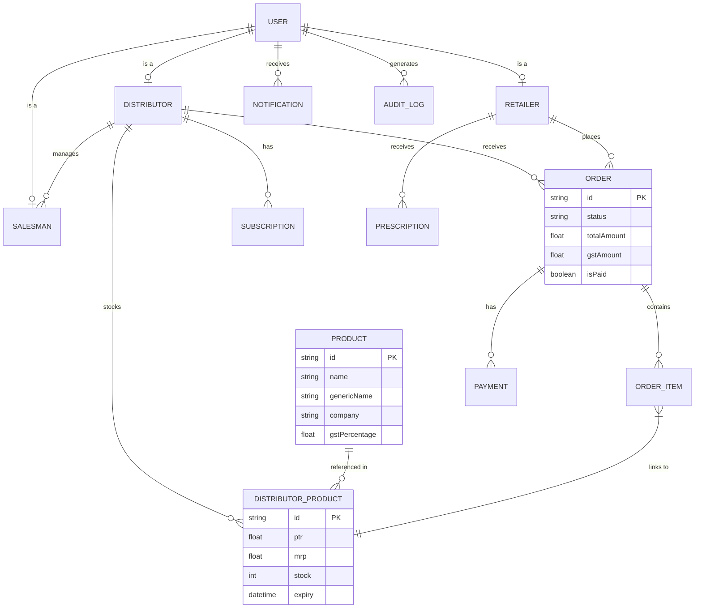

# Pharma Marketplace ER Diagram

## Relational Summary
- **Users**: Central identity table with RBAC (Admin, Distributor, Retailer, Salesman).
- **DistributorProduct**: Intersection table between Distributor and Product, representing specific inventory with PTR/MRP/Expiry.
- **Orders**: Multi-distributor order logic (split at service level).
- **Finance**: GST and Ledger reconciliation derived from Orders and Payments.
